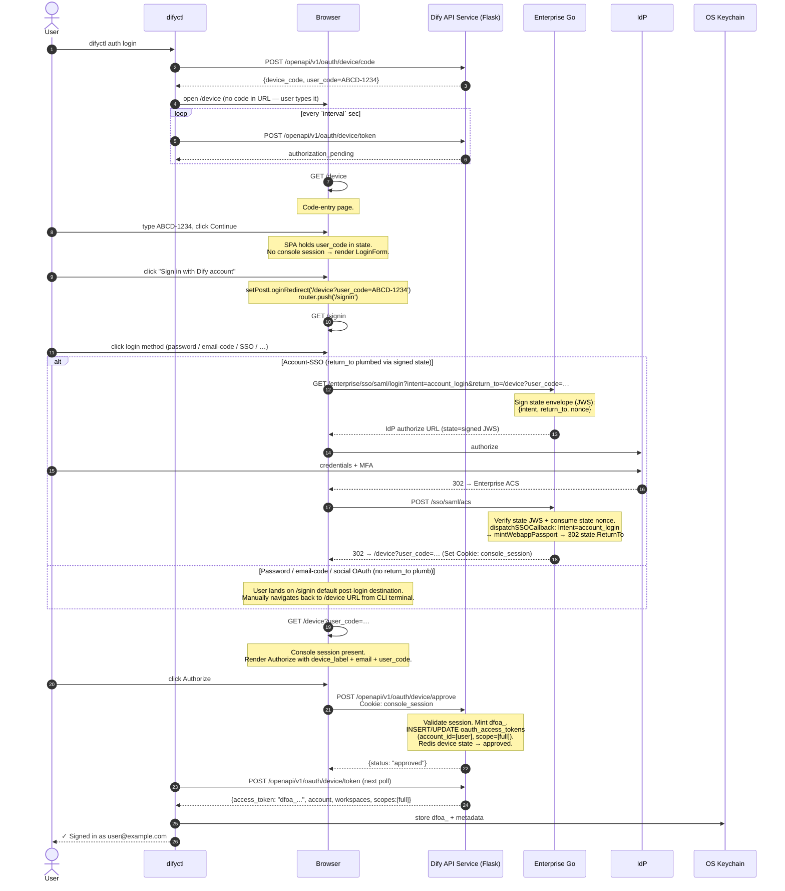
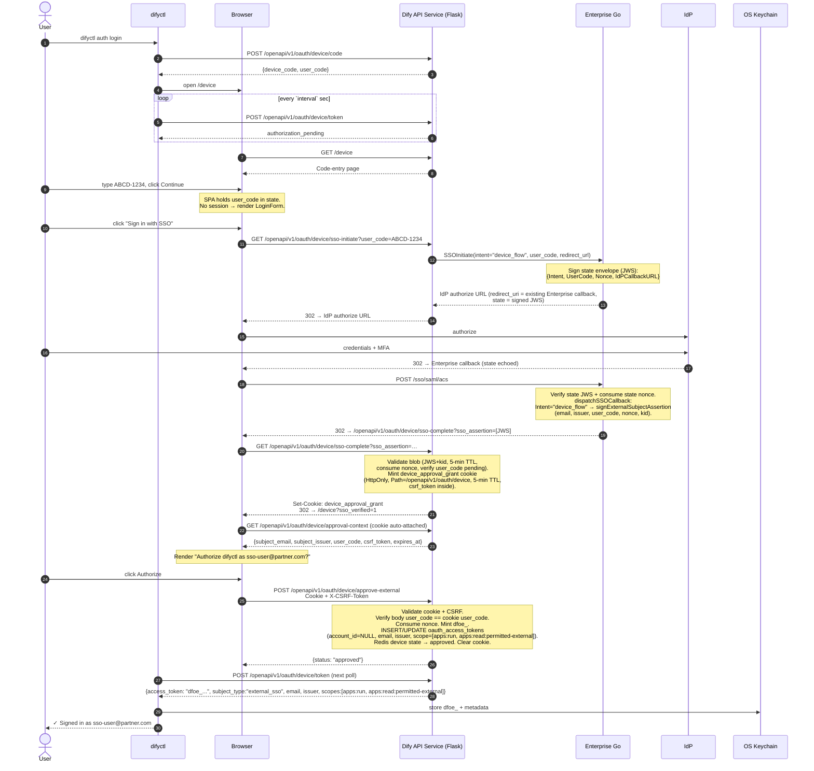

# device flow

OAuth 2.0 Device Authorization Grant (RFC 8628) for `difyctl auth login`. Two branches — account and External SSO — sharing one code-entry page and one Redis state machine.

Companion: `tokens.md` (storage), `middleware.md` (post-mint auth), `endpoints.md` (full endpoint table), `security.md` (rate limits + audit + anti-frame).

## Shape

CLI shows a one-time code + URL; user opens the URL on any device with a browser; server polls for approval. No PKCE + localhost callback.

## Ephemeral state (Redis)

Each attempt = short-lived state machine, 15-min TTL, single-use.

```
device_code:{device_code_value}   →   JSON:
  {
    "user_code":      "ABCD-1234",
    "client_id":      "difyctl",
    "device_label":   "difyctl on gareth-mbp",
    "status":         "pending" | "approved" | "denied",
    "subject_email":  null | "<email>",     // set on approval
    "account_id":     null | "<uuid>",      // may stay null for SSO-only
    "minted_token":   null | "dfoa_<43 chars>" | "dfoe_<43 chars>",
    "token_id":       null | "<uuid>",      // oauth_access_tokens.id after mint
    "created_at":     "<iso8601>",
    "created_ip":     "<caller IP at /device/code>",
    "last_poll_at":   "<iso8601>"           // for slow_down
  }

user_code:{user_code_value}   →   "<device_code_value>"   (reverse lookup)
```

Both keys `EX 900` (15 min). Matches RFC 8628 `expires_in`.

**Code format:**

- `device_code` = `dc_<32 base64url chars>` (~256 bit). Never user-facing.
- `user_code` = 8 chars `XXXX-XXXX`, uppercase, reduced alphabet (Crockford-style, ambiguous chars stripped). Low entropy by design — humans type it. Defended by rate-limit + 15-min TTL + single-use.

**Alphabet (literal, 30 chars):**

```
3 4 5 6 7 8 9 A B C D E F G H J K L M N P Q R S T U V W X Y
```

Excluded: `0` (vs `O`), `1` (vs `I`/`l`), `2` (vs `Z`), `O` (vs `0`), `I` (vs `1`), `Z` (vs `2`). Server normalizes input — uppercases, strips hyphen, rejects any char outside the alphabet with `400 invalid_user_code`.

**Collision handling.** 30⁸ ≈ 6.5 × 10¹¹ combinations. Silent overwrite would cross-authorize users. `/device/code` atomically claims `user_code` via Redis `SET NX EX` in a 5-attempt retry loop. After 5 collisions → `503 user_code_exhausted` (operator alarm — never seen in normal traffic). `device_code` entropy high enough that no such check is needed.

**State transitions:**

```
pending  → user clicks Authorize at /device  → approved
pending  → user clicks Cancel                → denied
pending  → 900s TTL elapses                  → evicted

approved → CLI poll reads minted_token       → DEL both keys
denied   → CLI poll reads status=denied      → DEL both keys
```

**Mint-at-approve semantics.** `oauth_access_tokens` row is written when the user clicks Authorize, not during CLI poll. Redis `minted_token` holds plaintext until the CLI poll retrieves it; then full state DEL'd (plaintext lives in Redis for seconds). On transition to `approved`, `EXPIRE` shrinks the key to `max(remaining_ttl, 60s)`. User-aborted approve (CLI never polls) leaves an orphaned row; user revokes via `auth devices list/revoke`.

## Account branch

User authenticates via password / email-code / social OAuth / account-SSO at `/signin`, returns to `/device`, clicks Authorize → mints `dfoa_`.



### Account-branch endpoints

All endpoint contracts (request/response, rate limits, auth): `endpoints.md`.

- `POST /openapi/v1/oauth/device/code` (unauthenticated) — CLI initiates. Response `interval` = **5 (RFC 8628 default)**, hardcoded server-side. CLI polls every `interval` seconds; clamps to `[1, 60]` defensively, treats `0` / negative / absent as `5`.
- `POST /openapi/v1/oauth/device/token` (unauthenticated, rate-limited) — CLI polls.
- `GET /openapi/v1/oauth/device/lookup` (public + rate-limit) — web validates typed code.
- `POST /openapi/v1/oauth/device/approve` (session) — web mints `dfoa_`.
- `POST /openapi/v1/oauth/device/deny` (session) — web denies.

### Approve implementation

`POST /openapi/v1/oauth/device/approve`:

1. `GET user_code:{user_code}` → device_code. Miss → 404.
2. `GET device_code:{device_code}`. Status ≠ pending → 409.
3. Resolve subject from session: `subject_email = session.email`; `account_id` = matching account, or NULL.
4. Read TTL: `ttl_days = Policy.OAuthTTLDays()`.
5. Generate `dfoa_` token. SHA-256.
6. **Upsert** `oauth_access_tokens` keyed on `(subject_email, subject_issuer, client_id, device_label)`. `device_label` from Redis state; `subject_issuer = NULL` on account branch:

   ```sql
   -- Caller normalizes :issuer before this query:
   --   account branch → :issuer = 'dify:account' (sentinel)
   --   SSO branch     → :issuer = <IdP entity_id / OIDC issuer URL>

   -- Capture old hash to invalidate Redis cache after upsert
   SELECT token_hash AS old_hash INTO <old_hash>
     FROM oauth_access_tokens
     WHERE subject_email = :email
       AND subject_issuer = :issuer
       AND client_id = :client AND device_label = :label AND revoked_at IS NULL;

   INSERT INTO oauth_access_tokens
     (subject_email, subject_issuer, account_id, client_id, device_label, prefix, token_hash, expires_at)
     VALUES (:email, :issuer, :account_id, :client, :label, :prefix, :new_hash,
             NOW() + (:ttl_days || ' days')::interval)
   ON CONFLICT (subject_email, subject_issuer, client_id, device_label) WHERE revoked_at IS NULL
   DO UPDATE SET
     token_hash   = EXCLUDED.token_hash,
     prefix       = EXCLUDED.prefix,
     account_id   = EXCLUDED.account_id,    -- handles CE→EE account provisioning
     expires_at   = EXCLUDED.expires_at,    -- rotate refreshes TTL from current policy
     created_at   = NOW(),
     last_used_at = NULL
   RETURNING id;
   ```

   `ON CONFLICT` matches the partial unique index `uq_oauth_active_per_device` (see `tokens.md §oauth_access_tokens`). Account branch writes the `'dify:account'` sentinel into `subject_issuer` at mint time so the column is never NULL — Postgres' default NULL-as-distinct semantics don't apply, and the plain partial unique index enforces "one active row per (email, issuer, client, device)" without needing a COALESCE expression index. Rows hard-expired via `tokens.md §Detection + hard-expire` (`revoked_at IS NOT NULL`) are excluded — so re-login after hard-expire takes the INSERT branch.

   - First login from this device → INSERT (new row, new `id`).
   - Re-login same device → UPDATE (same `id`, fresh `token_hash` + `created_at`). Old plaintext invalid at commit.
   - Login from different device → INSERT (new row, independent).

7. **Invalidate old Redis on rotation:** `DEL auth:token:{old_hash}`. No-op if no prior row. Without this, old cached entry could stay valid up to 60 s.
8. Update Redis `device_code:{device_code}` → `{status=approved, subject_email, account_id, minted_token=dfoa_..., token_id, ...}`. Scope not persisted; computed at CLI-poll response time. `EXPIRE` to `max(remaining_ttl, 60s)`.
9. **Mint policy validation.** For account branch: scope = `[full]`. SSO branch (see §External SSO branch): scope = `[apps:run, apps:read:permitted-external]`. Cross-subject scope minting → 400 `mint_policy_violation` before INSERT/UPDATE. CE deploys reject `dfoe_` mint entirely.
10. Emit audit `oauth.device_flow_approved` (payload: `subject_email`, `account_id` nullable, `client_id`, `device_label`, `scopes`, `token_id`, `subject_type`, `rotated: true|false`, `expires_at`).
11. Return `{ status: "approved" }`.

### Deny

`POST /openapi/v1/oauth/device/deny` — lookup same as approve, update Redis `{status=denied, …}` keeping TTL. Emit `oauth.device_flow_denied`. Return `{ status: "denied" }`.

### Poll

`POST /openapi/v1/oauth/device/token`:

1. `GET device_code:{device_code}`. Miss → `{error: "expired_token"}`.
2. If `last_poll_at < interval` sec ago → `{error: "slow_down"}`. Update `last_poll_at`.
3. Dispatch on `status`:
   - `pending` → `{error: "authorization_pending"}`.
   - `denied` → `{error: "access_denied"}`. `DEL` both keys.
   - `approved` → proceed.
4. **Validate minted row still live:** `SELECT 1 FROM oauth_access_tokens WHERE id=:token_id AND revoked_at IS NULL AND expires_at > NOW() AND token_hash IS NOT NULL`. Miss → token was revoked or hard-expired between approve and poll. Return `{error: "access_denied"}`, `DEL` both keys.
5. **Cross-IP audit:** if request IP ≠ `/device/code` creation IP, emit `oauth.device_code_cross_ip_poll` (payload: `token_id`, `subject_email`, `creation_ip`, `poll_ip`). Does not block — RFC 8628 allows this; audit enables admin detection.
6. Return success body. `DEL` both keys.

Success (account subject):

```json
{
  "token":                "dfoa_...",
  "expires_at":           null,
  "account":              { "id": "acc_...", "email": "...", "name": "..." },
  "workspaces":           [{ "id": "ws_...", "name": "...", "role": "owner" }],
  "default_workspace_id": "ws_..."
}
```

External SSO subject: `token = dfoe_...`, `account: null`, `workspaces: []`, plus `subject_type: "external_sso"`, `subject_email`, `subject_issuer`.

## External SSO branch

EE-only. SSO-verified IdP users without a Dify `accounts` row authenticate at the IdP, return with a signed external-subject assertion, accept a short-lived cookie, then click Authorize → mints `dfoe_`.

All four External-SSO API Service endpoints (`sso-initiate`, `sso-complete`, `approval-context`, `approve-external`) are gated by the `@enterprise_only` decorator. CE builds short-circuit to 404 before any business logic runs. Account-branch endpoints (`/openapi/v1/oauth/device/{code,token,lookup,approve,deny}`) are **not** decorated.



### Enterprise: SSO state envelope

State passed to the IdP (SAML RelayState / OIDC `state` / OAuth2 `state`) is a compact JWS envelope, signed HS256 with the shared Dify secret (`SECRET_KEY` on api / `DIFY_SECRET_KEY` on Enterprise). `kid` header selects the active key. One secret backs state envelope + subject assertion + approval cookie.

Envelope claims:

| Claim | Meaning |
|---|---|
| `intent` | `"webapp"` (legacy) / `"account_login"` / `"device_flow"`. Empty = `"webapp"` |
| `user_code` | Populated when `intent = "device_flow"` |
| `nonce` | Per-initiate; consumed at callback via `SET NX` to defeat state-JWS replay |
| `return_to` | Post-login target (e.g., `/device?user_code=X`); exact-path whitelisted |
| `idp_callback_url` | Existing Enterprise-registered callback (IdP-facing) |
| `app_code` | Empty unless `intent = "webapp"` |
| `redirect_url` | API Service redirect target |

Enterprise's callbacks reject any state whose signature fails. Signed state is mandatory — no phased rollout flag.

**Three intents (plus legacy empty/`"webapp"`):**

| `intent` | Behavior |
|---|---|
| `""` / `"webapp"` | Existing webapp-passport flow. `return_to` ignored. |
| `"account_login"` | Account-branch device-flow handoff. Mints console session, then 302s to `return_to` instead of default `/apps`. |
| `"device_flow"` | SSO-only device-flow handoff. Skips console-session/passport mint; signs external subject assertion; 302s to `idp_callback_url?sso_assertion=<JWS>`. |

Initiate handlers (SAML / OIDC / OAuth2 + external variants):

- `intent="device_flow"`: skip the webapp readiness check, allow empty `app_code`, populate `intent`/`user_code`/`nonce`.
- `intent="account_login"`: populate `intent`; require non-empty `return_to`.
- `return_to` present → validate via exact-path whitelist (`path == "/device"`, query keys ⊆ `{user_code, sso_verified}`). Anything else → 400 `invalid_return_to`.
- Sign state JWS with `kid`, attach to outbound IdP `state` / RelayState.

Callbacks verify state signature + `kid`, consume state nonce (`SET NX EX state_nonce:{nonce} 600` — defeats re-POST replay on ACS), then dispatch on `intent`:

- `webapp` → `mintWebappPassport`.
- `account_login` → `mintWebappPassport`, override redirect target with `return_to`.
- `device_flow` → sign short-lived external subject assertion (no `end_user` row, no webapp passport).

`device_flow` branch signs a short-lived external subject assertion:

```
302 Location: <IdPCallbackURL>?sso_assertion=<signed_blob>

Signed blob (compact JWS, HS256, shared Dify `SECRET_KEY`):
{
  "sub_type":  "external_sso",
  "email":     "<verified email from IdP>",
  "issuer":    "<IdP entity_id or issuer URL>",
  "user_code": "<from state.UserCode>",
  "nonce":     "<from state.Nonce>",
  "kid":       "api-ee-shared-v1",
  "iat":       <now>,
  "exp":       <now + 300>,
  "aud":       "api.device_flow.external_subject_assertion"
}
```

No `WebSSOLogin` / `WebSSOExternalLogin` call on device_flow path — no `end_user` row, no webapp passport. Enterprise's only job: verify IdP assertion, hand API Service verified identity.

### API Service: `sso-initiate`

`GET /openapi/v1/oauth/device/sso-initiate?user_code=<required>`. API-internal, not IdP-registered.

1. **Clear any stale `device_approval_grant` cookie** — `Set-Cookie: device_approval_grant=; Max-Age=0; Path=/openapi/v1/oauth/device`. Defends against cross-tab mixing and stale cookies from Back-button navigation.
2. Validate `user_code` maps to device_code in `pending`. Absent / unknown / not-pending → 400 `invalid_user_code`.
3. Read workspace-wide SSO config. None configured → 404 `sso_not_configured`.
4. Determine configured IdP type (exactly one per workspace today — SAML OR OIDC OR OAuth2).
5. Call matching Enterprise initiate with `intent="device_flow"` + `redirect_url="<host>/openapi/v1/oauth/device/sso-complete"` + `user_code` + no `app_code`.
6. Enterprise returns IdP auth URL with signed state attached. API Service 302s user to IdP.

**Decorator order.** `@enterprise_only` must run **before** `@rate_limit("60/hour/ip")` — otherwise CE 404s consume the bucket. Flask stack: `@enterprise_only → @rate_limit → handler`.

### API Service: `sso-complete`

`GET /openapi/v1/oauth/device/sso-complete?sso_assertion=<signed_blob>`.

1. Validate `sso_assertion` JWS signature with key identified by blob `kid` header. Invalid / expired (>5 min) / wrong `aud` / unknown `kid` → 400 `invalid_sso_assertion`.
2. Consume nonce: `SET NX EX sso_assertion_nonce:{nonce} 600`. Replay → 400.
3. Extract `subject_email`, `subject_issuer`, `user_code` from blob.
4. Verify `user_code` still maps to device_code in `pending`. Not pending → 409 — user retries from `/device` without burning another IdP round-trip.
5. **Email-collision reject.** If `subject_email` matches an active Dify Account row (case-insensitive — `func.lower(Account.email) == normalized`, filtered to `AccountStatus.ACTIVE`) → emit `oauth.device_flow_rejected` audit (payload: `subject_type="external_sso"`, `subject_email`, `subject_issuer`, `reason="email_belongs_to_dify_account"`), 302 → `/device?sso_error=email_belongs_to_dify_account`. The SSO branch is reserved for IdP users without a Dify account; account-SSO users must take Button 1.
6. Mint `device_approval_grant` cookie (see §Approval grant cookie). Fresh `nonce`, fresh `csrf_token`, 5-min TTL, signed with active API-side key.
7. `Set-Cookie: device_approval_grant=<jws>; HttpOnly; Secure; SameSite=Lax; Path=/openapi/v1/oauth/device; Max-Age=300`.
8. 302 → `/device?sso_verified=1`.

Cookie-then-redirect means the SPA detects SSO completion via a lookup call, not URL-fragment parsing. No JWT ever reaches page JS.

### API Service: `approval-context`

`GET /openapi/v1/oauth/device/approval-context`. No body. Browser attaches `device_approval_grant` cookie automatically (path-match).

1. Read + validate cookie (signature, `aud`, `exp`, kid resolvable). Missing / invalid → 401 `no_session`.
2. Return `{ subject_email, subject_issuer, user_code, csrf_token, expires_at }`.

Nonce NOT consumed here. Lookup idempotent — SPA may fetch on mount, refresh, React strict-mode double-render.

### API Service: `approve-external`

`POST /openapi/v1/oauth/device/approve-external`. Cookie-authed + CSRF double-submit.

**Subject invariant:** only External SSO subjects (no `accounts` row) reach this endpoint. The email-collision check at `sso-complete` (step 5 above) plus the explicit re-check here defend in depth — a cookie surviving an aborted `sso-complete` cannot promote an account email to an external SSO token.

Request headers: `Cookie: device_approval_grant=<jws>` + `X-CSRF-Token: <csrf_token from lookup>`.
Request body: `{ "user_code": "ABCD-1234" }`.

1. Validate cookie: signature, `aud == "api.device_flow.approval_grant"`, `exp > now()`, kid resolvable. Fail → 401 `invalid_session`.
2. Validate CSRF: header `X-CSRF-Token` == cookie claim `csrf_token`. Mismatch / absent → 403 `csrf_mismatch`.
3. Validate binding: body `user_code` == cookie claim `user_code`. Mismatch → 400 `user_code_mismatch`.
4. `GET user_code:{user_code}` → device_code. Miss → 404.
5. `GET device_code:{device_code}`. Status ≠ pending → 409.
6. **Email-collision reject (defense in depth).** If cookie `subject_email` matches an active Dify Account row (case-insensitive `func.lower(Account.email) == normalized`, filtered to `AccountStatus.ACTIVE`) → emit `oauth.device_flow_rejected` audit, 403 `email_belongs_to_dify_account`.
7. Claim cookie nonce: `SET NX EX device_approval_grant_nonce:{nonce} 600`. Already claimed → 401 `session_already_consumed`.
8. Resolve subject from cookie claims: `subject_email`, `subject_issuer`, `account_id = NULL`.
9. Read TTL: `ttl_days = Policy.OAuthTTLDays()`.
10. **Mint policy validation.** `dfoe_` mint locked to `scopes = [apps:run, apps:read:permitted-external]`. Any other requested scope → 400 `mint_policy_violation`. Cross-subject (e.g., approve-external attempting `[full]`) blocked here.
11. Generate `dfoe_` token, hash. Upsert `oauth_access_tokens` — same `ON CONFLICT` upsert as account branch, keyed on `(subject_email, subject_issuer, client_id, device_label)` with `account_id = NULL` and `subject_issuer` populated from cookie claim. `device_label` from Redis `device_code:{device_code}`.
12. `DEL auth:token:{old_hash}` on rotation.
13. Update Redis `device_code:{device_code}` → `{status=approved, subject_email, account_id:null, minted_token, token_id, …}`. `EXPIRE` to `max(remaining_ttl, 60s)`.
14. Emit `oauth.device_flow_approved` with `subject_type: "external_sso"`, `subject_email`, `subject_issuer`, `client_id`, `device_label`, `scopes: [apps:run, apps:read:permitted-external]`, `rotated`, `expires_at`.
15. Respond: `Set-Cookie: device_approval_grant=; Max-Age=0; Path=/openapi/v1/oauth/device`. Body `{ status: "approved" }`.

CLI poll at `POST /openapi/v1/oauth/device/token` picks up the token. Response: `account: null`, `workspaces: []`, `subject_email` populated.

## Approval grant cookie

SSO branch needs to carry IdP-authenticated identity from SSO callback to approve-external endpoint **without** granting console / webapp / `/v1/*` access. Existing webapp-SSO JWT is app-scoped — unsuitable.

`device_approval_grant` = short-lived compact JWS cookie (HS256, shared Dify `SECRET_KEY`), path-scoped to `/openapi/v1/oauth/device`. Zero authority beyond approving the specific device_code it's bound to. `HttpOnly` + `Path=/openapi/v1/oauth/device` + `SameSite=Lax`.

**Cookie envelope:**

```json
{
  "iss":            "<dify-host>",
  "aud":            "api.device_flow.approval_grant",
  "subject_email":  "user@example.com",
  "subject_issuer": "https://idp.example.com",
  "user_code":      "ABCD-1234",
  "nonce":          "<random>",
  "csrf_token":     "<random>",
  "kid":            "api-ee-shared-v1",
  "exp":            <now + 300>,
  "iat":            <now>
}
```

**Cookie attributes:**

```
Set-Cookie: device_approval_grant=<jws>;
            HttpOnly; Secure; SameSite=Lax;
            Path=/openapi/v1/oauth/device; Max-Age=300
```

**Isolation:**

| Session | Valid on | TTL | Reusable |
|---|---|---|---|
| Console account session | `/console/api/*` | hours, refreshable | yes |
| Webapp passport | `/passport` + webapp routes, scoped to `app_code` | per-app-configured | yes |
| **`device_approval_grant`** | **`/openapi/v1/oauth/device/approval-context` + `/openapi/v1/oauth/device/approve-external` only** | **5 min, one-shot** | **no** (single nonce, bound to single `user_code`) |

**Enforcement:**

1. **Path scoping.** `Path=/openapi/v1/oauth/device` — browser does not attach to other URLs. Console / webapp / `/v1/*` / other `/openapi/v1/*` middlewares never see this cookie.
2. **Audience binding.** Validator checks `aud == "api.device_flow.approval_grant"`. Any future cookie with different `aud` → cross-reject.
3. **One-shot nonce.** `SET NX EX device_approval_grant_nonce:{nonce} 600`. Replay → 401 `session_already_consumed`. Nonce burned at approve-external success, not at lookup — user can hit lookup repeatedly without burning.
4. **User-code binding.** Body `user_code` must equal cookie claim. Prevents leaked cookie from approving a different pending device_code.
5. **CSRF double-submit.** Approve must include `X-CSRF-Token` matching cookie claim `csrf_token`. Cookie alone insufficient. `csrf_token` + `nonce` = ≥16 bytes (128-bit) CSPRNG.
6. **Short TTL.** 5 min — covers human approval delay, bounds leak exposure.

**Nonce TTL 2×.** Redis nonce keys use 600 s (10 min) while cookie / assertion lifetimes are 300 s (5 min). The 2× ratio defeats late-replay if clock skew between Redis and JWS issuer allows a just-expired cookie to verify as non-expired when Redis sees the key gone.

**Three-nonce model.** Each nonce defends a distinct hop. Removing any one opens a replay class.

| Nonce | Origin | Consumed at | Redis key | Defeats |
|---|---|---|---|---|
| `state.Nonce` | Enterprise `sso-initiate` | Enterprise ACS / callback (`SET NX`) | `state_nonce:{n}` on Enterprise | Re-POST replay on IdP callback |
| subject-assertion `nonce` | Enterprise `dispatchSSOCallback` | API Service `/openapi/v1/oauth/device/sso-complete` (`SET NX`) | `sso_assertion_nonce:{n}` on API Service | Replay of leaked `?sso_assertion=…` URL |
| cookie `nonce` | API Service `/openapi/v1/oauth/device/sso-complete` | API Service `/openapi/v1/oauth/device/approve-external` (`SET NX`) | `device_approval_grant_nonce:{n}` on API Service | Replay of approval-grant cookie after prior approve |

**What the cookie cannot do:** reach `/console/api/*` / `/passport` / `/v1/*` / other `/openapi/v1/*` (browser doesn't send it outside `/openapi/v1/oauth/device/*`); approve a different `user_code` (bound at mint); replay after approve (nonce consumed); be read by JS (`HttpOnly`); persist past 5 min.

**Key rotation.** State envelope + subject assertion + cookie all carry `kid` and use HS256 with the shared Dify `SECRET_KEY` key-set (same secret already shared between API Service and Enterprise — no dedicated signing-key env var). Rotation = append new `kid` to config, overlap window (1 h covers any in-flight 5-min blob), retire old `kid`. Both services reload key-set at process boot and on config reload. One secret, three uses, one rotation.

## Web UI contract

One new surface on `dify/web` (Next.js): the `/device` two-button page. Account-page management of CLI sessions is CLI-only (`auth devices list/revoke`). Full security headers: `security.md §Anti-framing`.

### `/device` — two-button login

Top-level page, unauthenticated entry allowed. User self-selects branch based on identity type.

Renders the same `LoginForm` React component used by `/signin` with a `variant="device-authorization"` prop. Only the dispatch targets differ per variant.

```
<LoginForm
  variant="device-authorization"
  user_code={entered}
  ssoButtonHidden={!ssoAvailable}
  onAccountLogin={() => {
    setPostLoginRedirect('/device?user_code=' + entered)
    router.push('/signin')
  }}
  onSSOLogin={() => redirect('/openapi/v1/oauth/device/sso-initiate?user_code=' + entered)}
/>
```

**SSO availability gate.** `/device` derives `ssoAvailable` from `systemFeatures.webapp_auth`:

```ts
const ssoAvailable =
  systemFeatures.webapp_auth.enabled &&
  systemFeatures.webapp_auth.allow_sso &&
  Boolean(systemFeatures.webapp_auth.sso_config.protocol)
```

Same triplet the existing `/device` page already evaluates (see `dify/web/app/device/page.tsx`). All three fields ship server-side via `GET /console/api/system-features` regardless of edition; CE deploys (`ENTERPRISE_ENABLED=false`) never populate `sso_config.protocol`, so the SSO button never renders. No new system-features field needed.

**States:**

1. **Code entry.** Text input, label "Enter the code shown in your terminal", placeholder `ABCD-1234`. Button "Continue". Auto-uppercase, auto-hyphenate. Required before either login button enables.
2. **Login chooser.** Shown if user not authenticated after code entry.
   - **Button 1 — "Sign in with Dify account"** (covers password + email-code + GitHub / Google social OAuth + account-SSO). Dispatch: `setPostLoginRedirect('/device?user_code=<code>')` + `router.push('/signin')`. Target persists via sessionStorage (tab-scoped, survives same-tab cross-origin bounces). Every login-success handler — password, email-code verify, social-OAuth callback landing via `app-initializer`, account-SSO callback landing via `app-initializer` — consumes `resolvePostLoginRedirect()` before falling to `/apps` default. Account-SSO additionally plumbs `return_to` through IdP state (see below) because signed state is required for IdP cross-origin preservation in principle, but sessionStorage covers the browser-side path.
   - **Button 2 — "Sign in with SSO"** (External SSO IdP users, no `accounts` row). Hidden when workspace-wide SSO not configured. Dispatch: `/openapi/v1/oauth/device/sso-initiate?user_code=<entered>` → state-intent dispatch → `/openapi/v1/oauth/device/sso-complete` sets `device_approval_grant` cookie → 302 → `/device?sso_verified=1`. SPA calls `GET /openapi/v1/oauth/device/approval-context` to render Authorize.
3. **Authorize screen.**
   - Heading: "Authorize Dify CLI"
   - Body: `Dify CLI (difyctl) is requesting access to your account. If you did not start this from your terminal, click Cancel.`
   - Signed-in-as: `Signed in as <email>` (session or cookie claim)
   - Workspace (account path only): `Default workspace: <name>`
   - Buttons: `Authorize` (primary) + `Cancel` (secondary). No scope checkboxes, no role pickers.
4. **Success.** Heading: "You're signed in". Body: "Return to your terminal to continue." No auto-close, no summary, no revoke.
5. **Error / expired.** Heading: "This code is no longer valid". Body: "The code may have expired or already been used. Run `difyctl auth login` again to get a new one." No retry input.

**`postLoginRedirect` helper.** `web/app/signin/utils/post-login-redirect.ts` — sessionStorage-backed, 15-min TTL. `setPostLoginRedirect(target)` validates same-origin + exact-path whitelist (`/device` with `{user_code, sso_verified}` query keys; `/account/oauth/authorize` with OAuth-dance keys) before storing. `resolvePostLoginRedirect()` re-validates on read. Tab-scoped — concurrent `/device` tabs don't clobber each other. Stale values expire after 15 min.

**Account-SSO `return_to` plumbing.** Web `sso-auth.tsx` snapshots `postLoginRedirect` into a local `const` on the first synchronous tick of the click handler (defeats React strict-mode double-invoke and tab-duplication races), passes as `return_to` to `/enterprise/sso/{saml,oidc,oauth2}/login?intent=account_login&return_to=<url>`. Enterprise validates exact path, signs into state, honors on callback.

**Covered sign-in flows:** password, email-code, GitHub, Google, account-SSO — all preserve `/device?user_code=...` via sessionStorage through in-tab navigation and cross-origin callback bounces, consumed by `app-initializer.tsx` or the signin-form success handlers.

**Known gap:** signup via email-verification link opened in a new tab loses sessionStorage (new browsing context). Signup flow falls to `/apps` default; user manually reopens the CLI-printed `/device` URL.

### Shared

- Existing console layout, typography, locale files.
- EN + ZH at launch.

## Rate limits

See `security.md §Rate limits` for the full table. Key values:

- `POST /openapi/v1/oauth/device/code` — 60 / hr / IP.
- `POST /openapi/v1/oauth/device/token` — 1 / `interval` / device_code (RFC 8628 `slow_down`).
- `GET /openapi/v1/oauth/device/sso-initiate` — 60 / hr / IP (`@enterprise_only` gate runs first).
- `POST /openapi/v1/oauth/device/approve-external` — 10 / hr / `subject_email`.
- `POST /openapi/v1/oauth/device/approve` — 10 / hr / session.

## Audit

See `security.md §Audit events`. Device-flow-specific events:

- `oauth.device_flow_approved` — on mint (both branches), carries `rotated`, `subject_type`, `subject_issuer`.
- `oauth.device_flow_denied` — on cancel.
- `oauth.device_flow_rejected` — email-collision reject on SSO branch (`sso-complete` or `approve-external`).
- `oauth.device_code_cross_ip_poll` — CLI polled from different IP than `/device/code` caller.
